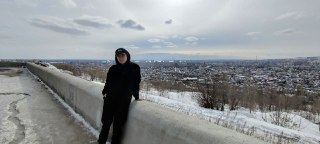

--- 
title: Как я провёл неделю 
 
 
# Link this post with a project 
projects: [] 
 
# Date published 
date: '2020-12-13T00:00:00Z' 
 
# Date updated 
lastmod: '2020-12-13T00:00:00Z' 
 
# Is this an unpublished draft? 
draft: false 
 
# Show this page in the Featured widget? 
featured: false 
 
# Featured image 
# Place an image named `featured.jpg/png` in this page's folder and customize its options here. 
image: 
  caption: 'Image credit: [**Unsplash**](https://unsplash.com/photos/CpkOjOcXdUY)' 
  focal_point: '' 
  placement: 2 
  preview_only: false 
 
authors: 
  - admin 
 
tags: 
  - live 
 
categories: 
  - Demo 
--- 
 
 
## Overview 
 
Поездка в Саратов оказалась незабываемым приключением. Я отправился в этот город на юге России, чтобы исследовать его историю, культуру и красоты. 
Прибыв в Саратов, меня поразила его уникальная архитектура. Город расположен на берегу Волги, и его исторический центр украшен великолепными зданиями, которые напоминают о богатом прошлом этого места. 
Я также побывал в многочисленных музеях и галереях Саратова, где познакомился с богатой историей и культурой этого региона. Особенно запомнилась поездка в музей известного русского художника Константина Коровина, который родился и вырос в Саратове. 
Вечерами я гулял по живописным набережным Волги, наслаждаясь красивыми закатами и уютными ресторанами, где можно попробовать местные деликатесы. 
Поездка в Саратов стала для меня настоящим открытием и приятным отдыхом. Я узнал о многом новом, почувствовал дух этого замечательного города и оставил в сердце частичку его неповторимой атмосферы. 

